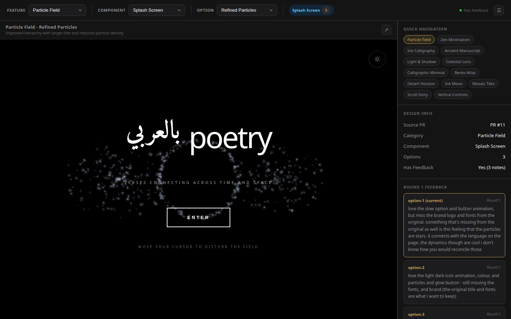
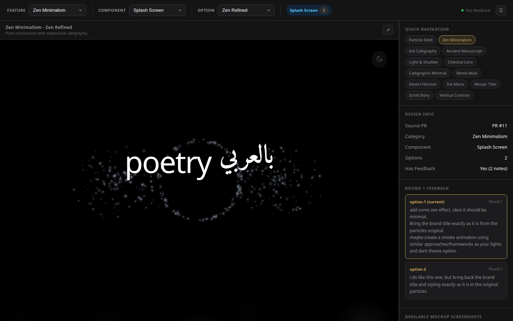
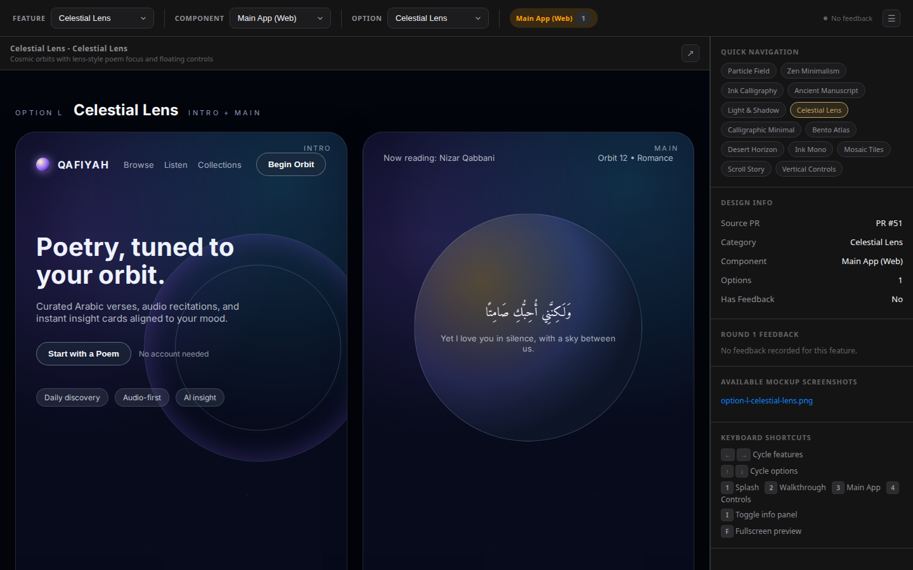
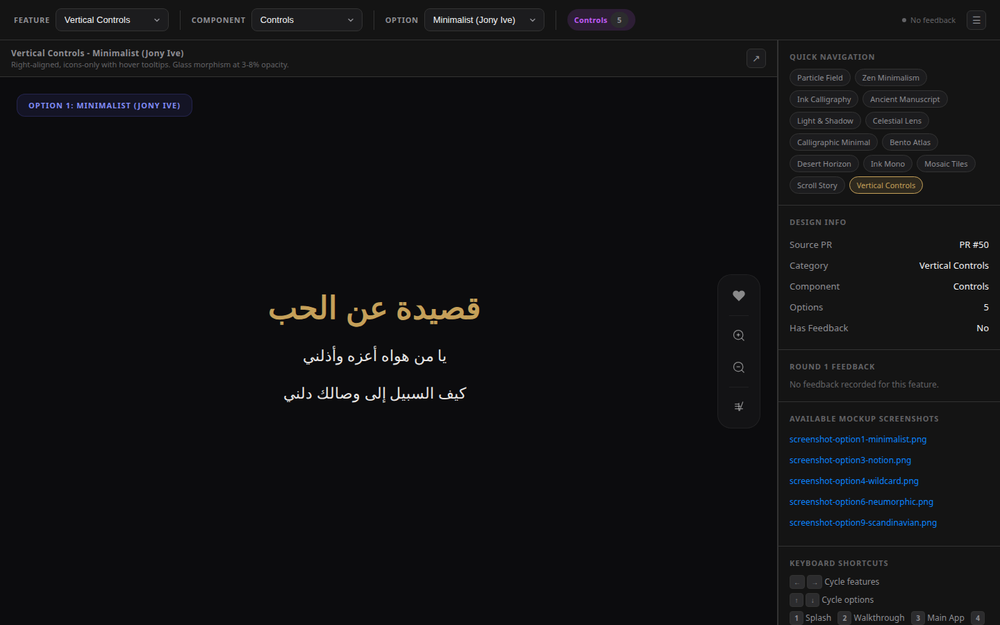

# Design Screenshots Gallery

Screenshots grouped by feature/component/design round for PR review.

> Open the HTML preview files in a browser for interactive versions with animations.

---

## Splash Screen Designs (PR #11, Round 1)

### 1. Particle Field

**Current State**

**Options:** Refined Particles, Gold Mystical, Minimal Constellation
- Interactive previews: `splash/particles/previews/`

---

### 5. Zen Minimalism

**Current State**

**Option 1: Zen Refined**

**Option 2: Haiku Style**

**Option 3: Breathing**

---

### 7. Ink Calligraphy

**Current State**

**Option 3: Live Calligraphy**

---

### 8. Ancient Manuscript

**Current State**

**Option 1: Ornate Islamic**

**Option 2: Codex Spine**

**Option 3: Scroll & Seal**

---

### 9. Light & Shadow

**Current State**

**Option 1: Chiaroscuro**

**Option 2: Soft Depth**

**Option 3: Ray Tracing**

---

## Main App Desktop Views (PR #51)

**L: Celestial Lens** - Cosmic orbits, lens-style focus

**M: Calligraphic Minimal** - Parchment, ink strokes

**N: Bento Atlas** - Modular bento grid

**O: Desert Horizon** - Warm sunrise gradients

**P: Ink Mono** - Monochrome editorial

**T: Mosaic Tiles** - Geometric tile navigation

**U: Scroll Story** - Chapter timeline with sticky nav

---

## Vertical Control Bar (PR #50)

**Option 1: Minimalist** - Jony Ive, glass morphism, right-aligned

**Option 3: Notion/Linear** - Clean functional, compact

**Option 4: Brutalist Terminal** - Retro CRT, monochrome green

**Option 6: Neumorphic** - Soft UI, tactile states

**Option 9: Scandinavian** - Nordic minimal, circular buttons

---

## Review Page

**Particle Field - Splash with feedback panel**

**Zen Minimalism - Splash with Zen feedback**

**Celestial Lens - Main App Desktop**

**Vertical Controls - Minimalist option**

