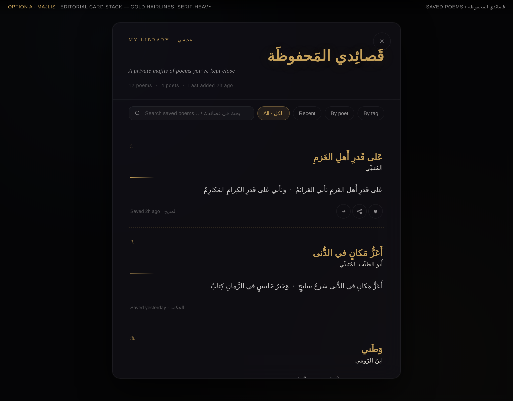
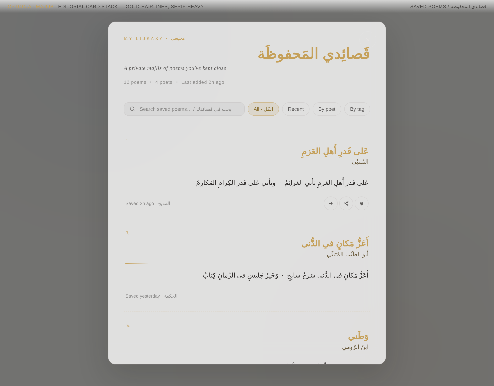
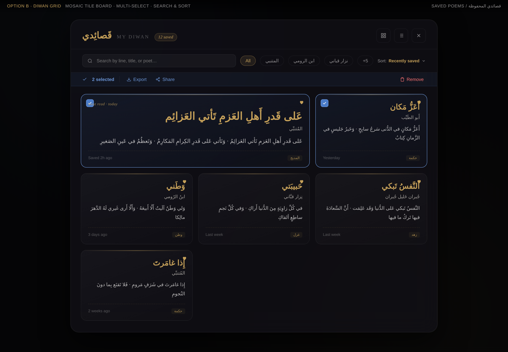
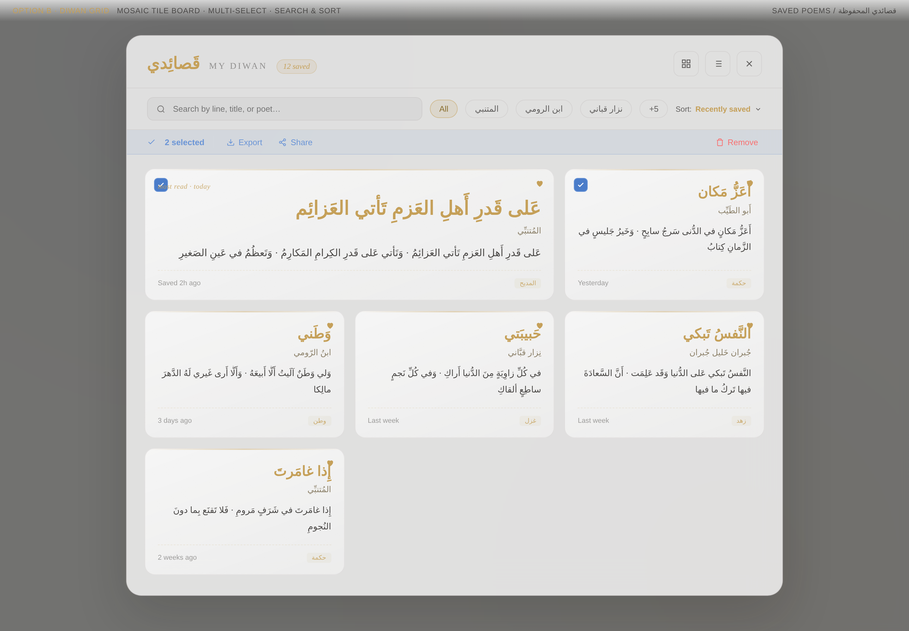
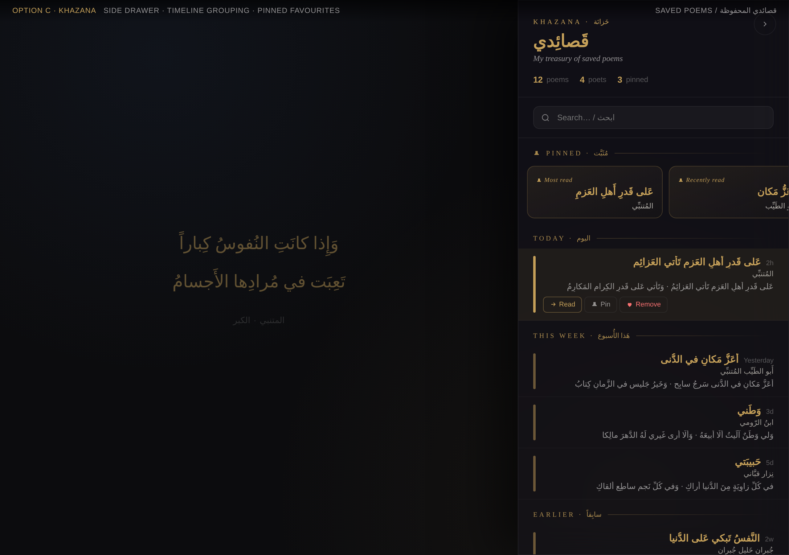
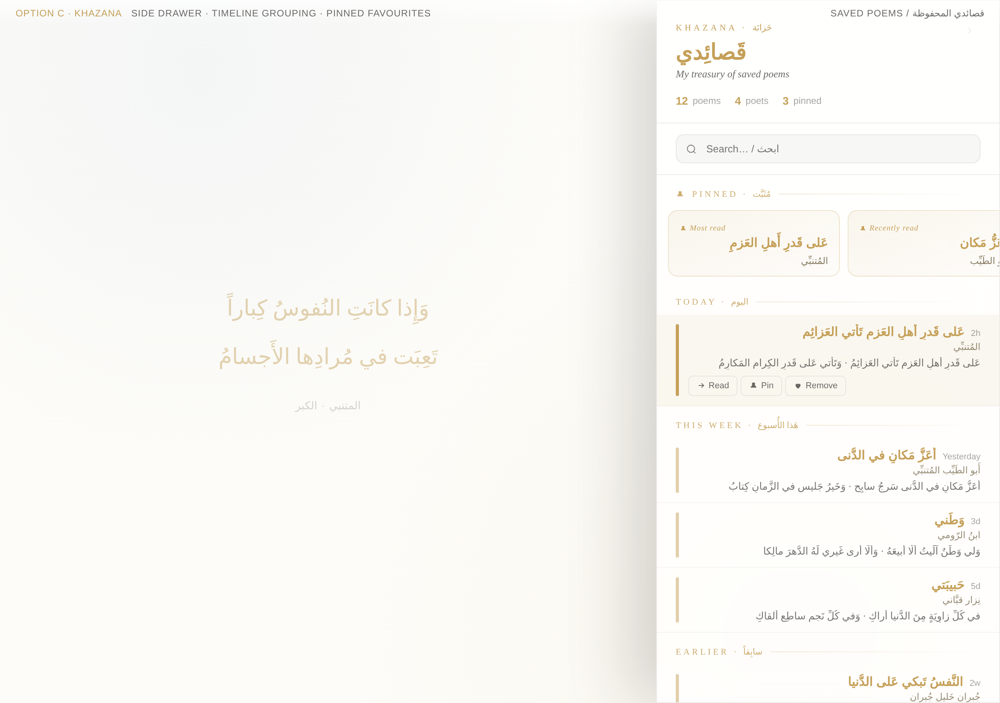

# 🎨 Library Redesign — Three Design Options

> The "library feature" in this app is the **Saved Poems** modal
> (`src/components/auth/SavedPoemsView.jsx` — "قصائدي المحفوظة / My Saved Poems").
>
> This document presents three alternative design directions for that surface.
> All mockups are **static HTML** (no production code touched) and use the existing
> design tokens: gold `#C5A059`, lapis `#4A7CC9`, glass surfaces, `rounded-2xl`,
> and the project's font stack (`Reem Kufi`, `Amiri`, `Fustat`, `Bodoni Moda`,
> `Forum`, `Tajawal`).

---

## 🧭 What today's library looks like (baseline)

A centered modal (max-width `2xl`) showing a flat list of saved poems. Each row
shows poet, English title, a 2-line Arabic excerpt, a "saved at" stamp, and a
single heart-toggle to unsave. There is no search, no filter, no grouping, and
no bulk actions. The empty state is a faded heart + a single line of help text.

**Pain points the redesign addresses**
1. No way to find a specific saved poem once the list grows.
2. No sense of *time* or *category* — every poem looks the same.
3. The unsave heart is the only action; reading, sharing, and pinning are absent.
4. The Arabic title is rendered in `Amiri` body type rather than the project's
   editorial display face (`Reem Kufi`), so it doesn't sit in the same
   typographic hierarchy as the main poem view.
5. Empty state offers no path forward.

---

## ✨ Option A — **Majlis** · مَجلِس
*Editorial card stack — gold hairlines, serif-heavy*

A quiet, library-of-rare-books direction. Each saved poem is rendered as a
"leaf" with a Roman numeral, the Arabic title in `Reem Kufi` gold, the poet
in `Fustat`, a short gold rule, then an `Amiri` excerpt with proper RTL
diacritics. Hover surfaces three round actions (read · share · remove).

**Why pick this**
- Matches the editorial DNA of the existing poem view almost verbatim.
- Reading-first: typography hierarchy mirrors the primary surface.
- Lowest implementation cost — same modal shell, just better contents.

**Why not**
- Less efficient for users with many saved poems (no grouping, no bulk).
- One column only — feels less "collection-like".

| Dark | Light |
| :---: | :---: |
|  |  |

**Mockup:** [`mockups/option-a-majlis.html`](mockups/option-a-majlis.html)

**Key elements**
- Header with eyebrow `MY LIBRARY · مَجلِسي`, large gold `Reem Kufi` Arabic
  title, italic `Bodoni Moda` English subtitle, then a meta strip
  (`12 poems · 4 poets · Last added 2h ago`).
- Filter chip row: All / Recent / By poet / By tag, with an inline search
  field (`Search saved poems… / ابحث في قصائدك`).
- Each leaf: numeral → Arabic title → poet → 60px gold rule → Arabic excerpt
  → footer (`Saved 2h ago · المديح`) with hover-revealed action triad.

---

## 🧱 Option B — **Diwan Grid** · ديوان
*Mosaic tile board · multi-select · search & sort*

A collection-first direction. Saved poems become a 3-column tile mosaic with
one "featured" tile spanning two columns. The toolbar combines a real search,
poet-filter chips (`المتنبي · ابن الرومي · نزار قباني · +5`), and a sort
dropdown (`Recently saved ▾`). A blue selection bar appears the moment the
user enters multi-select, exposing **Export · Share · Remove** as bulk actions.

**Why pick this**
- Scales gracefully to dozens or hundreds of saved poems.
- Adds the most missing capabilities: filter, sort, search, multi-select,
  export/share — useful for power-users and study sessions.
- Visually rich — the tile board is the most "diwan-like" of the three.

**Why not**
- Highest implementation cost; introduces a real selection state machine.
- Less reading-focused; tiles preview rather than present poems.

| Dark | Light |
| :---: | :---: |
|  |  |

**Mockup:** [`mockups/option-b-diwan-grid.html`](mockups/option-b-diwan-grid.html)

**Key elements**
- Header with `قَصائِدي · MY DIWAN · 12 saved` pill, plus grid/list view
  toggles and a close button.
- Toolbar: search + chips + sort dropdown.
- Active selection bar (lapis tint) with `2 selected · Export · Share ·
  Remove`.
- Featured tile uses the larger `Reem Kufi` size (≈30px) with a 4-line
  Amiri excerpt; standard tiles use 22px titles + 3-line excerpts.
- Each tile carries a category tag (`المديح · حكمة · غزل · زهد …`),
  saved-at stamp, gold heart, and a hover-revealed checkbox in the
  top-left.

---

## 🗝️ Option C — **Khazana** · خَزانَة
*Right-side drawer · timeline grouping · pinned favourites*

A non-blocking direction. Instead of a centered modal that hides the app,
Khazana slides in from the right and **leaves the current poem visible**
behind a soft scrim — so a reader can flip between the poem and their
saved-list without losing context. Poems are grouped by recency
(`Today · This week · Earlier`) and the user's pinned favourites live in a
horizontal scroll strip at the top.

**Why pick this**
- Best for the "reading flow" — the user never loses their place.
- Time grouping + pinning feels like a real personal treasury.
- Compact rows scan quickly; matches mobile patterns (swipeable drawer).

**Why not**
- Drawer pattern is new to the app and requires careful mobile handling.
- Less spacious than A or B for poem excerpts.

| Dark | Light |
| :---: | :---: |
|  |  |

**Mockup:** [`mockups/option-c-khazana.html`](mockups/option-c-khazana.html)

**Key elements**
- 440px right drawer, leaving the active poem dimmed at 45% behind it.
- Header: `KHAZANA · خَزانَة` eyebrow → `قَصائِدي` title → italic
  English subtitle → stat row (`12 poems · 4 poets · 3 pinned`).
- Pinned strip: horizontally scrollable cards with gold gradient borders,
  each tagged (`Most read · Recently read · Pinned by you`).
- Timeline rows grouped under `TODAY · THIS WEEK · EARLIER` with thin
  Forum-serif uppercase labels and a fading gold rule.
- Each row is a single line (poet/title/excerpt truncated) with a 4px
  gold marker bar at the start; hover or focus reveals inline
  `Read · Pin · Remove` chip actions.

---

## 📐 Comparison at a glance

| Capability                 | A · Majlis | B · Diwan Grid | C · Khazana |
| -------------------------- | :-------: | :------------: | :---------: |
| Search                     | ✅        | ✅             | ✅          |
| Poet/category filter       | chips     | chips + sort   | search only |
| Time grouping              | —         | sort           | ✅ sections |
| Pinned / favourites        | —         | featured tile  | ✅ strip    |
| Multi-select & bulk action | —         | ✅ (Export/Share/Remove) | — |
| Reading-flow preserved     | modal     | modal          | ✅ drawer   |
| Inline actions per item    | hover triad | hover heart  | ✅ chips    |
| Implementation cost        | 🟢 low    | 🟠 high        | 🟡 medium   |
| Mobile fit                 | 🟡 ok     | 🟠 needs reflow | 🟢 native pattern |
| Visual density             | low       | high           | medium      |

---

## 🧪 Recommendation

If we have to pick one: **Option C (Khazana) as the primary, with bulk
actions from Option B** layered in once the saved-list passes ~10 items.
It preserves the app's reading-first identity while fixing the four big
gaps (no search, no grouping, no pin, no bulk).

If we want the **smallest possible diff** that still meaningfully improves
today's surface: ship **Option A (Majlis)** — it's a near drop-in
replacement for `SavedPoemsView` and brings the typography in line with
the main poem view.

---

## 🔍 How to view the mockups locally

```bash
# From the repo root
open design-review/library-redesign/mockups/option-a-majlis.html
open design-review/library-redesign/mockups/option-b-diwan-grid.html
open design-review/library-redesign/mockups/option-c-khazana.html
```

Toggle the body class between `theme-dark` and `theme-light` in DevTools to
preview either palette — both are checked-in.
