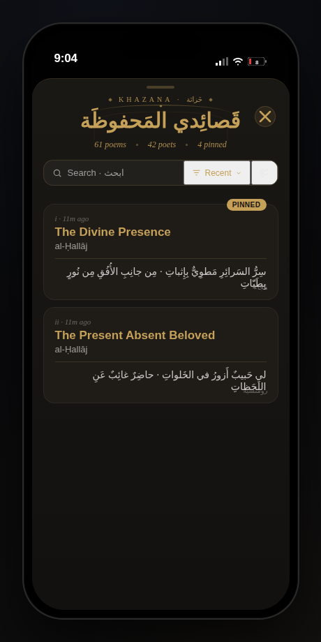
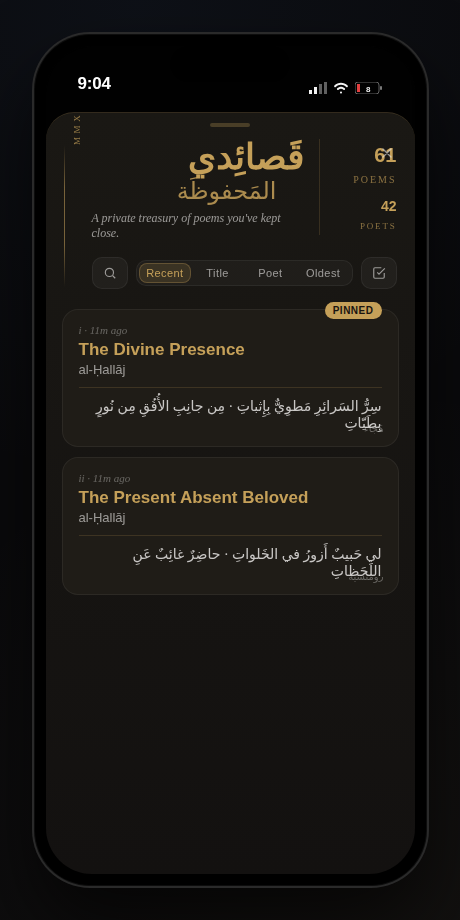
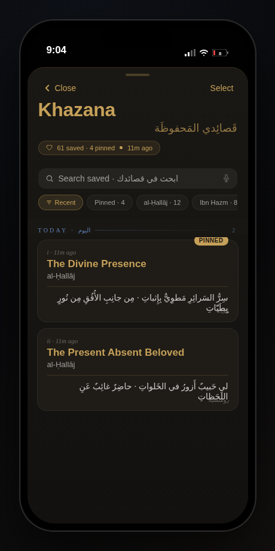

# Khazana drawer — header redesign · v4

Three sleek, distinct directions for the **top part** of the saved-poems drawer
(`src/components/auth/SavedPoemsView.jsx`), in response to Siraj's note on the
shipped Khazana drawer: the current eyebrow + giant `قصائدي المحفوظة` +
tiny stats + search/sort/select row reads heavy on iOS and needs a refactor.

> These are mockups only — **no production code changes**. The HTML lives next
> to the previous Khazana exploration under `design-review/library-redesign/`
> per the existing pattern. Each option is rendered inside an iPhone-shaped
> shell so the screenshots match Siraj's reference frame.

| File | Direction |
| --- | --- |
| [`h1-mihrab.html`](./h1-mihrab.html)        | **H1 · Mihrab** — arch motif + unified glass toolbar pill |
| [`h2-editorial.html`](./h2-editorial.html)  | **H2 · Editorial Index** — magazine masthead + segmented sort |
| [`h3-ios-compact.html`](./h3-ios-compact.html) | **H3 · iOS Compact** — Apple-Notes large title + count chip + scrollable filter pills |

Screenshots: `design-review/library-redesign/screenshots/header-v4/`.

---

## H1 · Mihrab (مِحراب)

Tiny gold-lozenge eyebrow, the title sits inside a faint mihrab arch with a
single keystone dot, stats collapse to one dotted line, and **search · sort ·
select all share a single glass pill** — one toolbar instead of three competing
controls. Closest to the editorial DNA of the app; most "sacred manuscript".

**Trade-offs**
- 🟢 Very compact (≈ 200 px), keeps poem rows above the fold on iPhone
- 🟢 Single unified toolbar feels custom and intentional
- 🟡 Arch SVG is decorative — must scale cleanly at 320–430 dp widths

---

## H2 · Editorial Index

A magazine-cover masthead. A vertical gilt rule + tiny `MMXXV · VOL. I` stamp
sit on the left edge; the Arabic title breaks into two calligraphic lines with
an offset for the second word; right side carries a small ledger ("61 Poems /
42 Poets") separated by a hairline. Sort becomes a **4-option segmented
control** (Recent · Title · Poet · Oldest) so it's one tap instead of opening
a dropdown. Search is a leading icon button that expands inline.

**Trade-offs**
- 🟢 Most distinctive — feels like a "Vol. I" of your private diwan
- 🟢 Segmented sort exposes options without an extra tap
- 🟡 Tallest header (≈ 250 px); fewer rows above the fold
- 🟡 Decorative vertical "MMXXV" stamp risks clipping at very narrow widths

---

## H3 · iOS Compact

Closest to a native iOS pattern (Notes / Mail). `< Close` and `Select` are
plain gold text buttons in the top row; "Khazana" sits as a 32 px bold large
title with `قَصائِدي المَحفوظَة` as a subtitle aligned bottom-right of the
same line; a small heart-prefixed count chip replaces the eyebrow + stats
combo. Below: the iOS standard rounded search field with a leading magnifier
and trailing dictation mic, then a **horizontally scrollable filter rail**
(Recent · Pinned · poet chips), and finally a sticky lapis-tinted section
header (`TODAY · اليوم — 2`) that locks at the top as you scroll.

**Trade-offs**
- 🟢 Most familiar; lowest cognitive cost on iPhone
- 🟢 Filter rail surfaces poets *and* "Pinned" as first-class filters
- 🟡 Sacrifices some of the manuscript/editorial mood for native chrome

---

## Bonus — improvements for the rest of the drawer

Applicable regardless of which header lands:

1. **Compact rows by default.** Today a row is ~110 px (verse line + stamp).
   Trim to ~64 px (title + poet + faded one-line preview) and reveal the verse
   only on tap or hover — that yields ~3× density and matches Siraj's
   feedback that the current list "feels like 2 saved poems per screen".
2. **Pinned strip → horizontal card row.** Instead of stacking pinned items
   in the same vertical list, render them as a short horizontally-scrollable
   row of square cards with a gold ring; the timeline below stays clean.
3. **Sticky time-group headers.** When the user scrolls *Today → This week →
   Earlier*, the section title sticks to the top of the list with a soft
   lapis underline (mocked in H3) — preserves orientation in long libraries.
4. **Swipe actions get narrower.** Today the swipe reveals a full red panel
   (`Remove`) that visually shouts. Replace with a narrow trailing column
   showing **Pin** (gold) and **Remove** (red) icons side by side, ~64 px
   each — same as iOS Mail. Matches Siraj's earlier A-Majlis feedback
   ("hide delete and pin behind swipe").
5. **Bulk-action bar at the top, not the bottom.** When `Select` mode is on,
   morph the *toolbar row* into a dark gold action tray (Pin · Share ·
   Remove · `n selected`). Less thumb travel on iPhone Plus / Pro Max where
   the bottom tray is hard to reach one-handed.
6. **"Clear filters" inline empty state.** When search/poet-filter return
   zero rows, render a single italic line ("No poems match · Clear filters")
   instead of the full empty illustration that's currently used.
7. **Sort dropdown → segmented control on the toolbar.** Already shown in
   H2; saves one tap and surfaces the current sort at all times.

---

## Recommendation

- **Ship:** H3 · iOS Compact as the new default — it's the cheapest to build,
  the densest on iPhone, and pairs naturally with bonus items 1, 3 and 4.
- **Keep H1 in reserve** as a "reading mode" toggle for users who'd rather
  see the manuscript treatment.
- **H2 is the boldest** — best for a marketing screenshot, but the tallest
  header and the most type-treatment to maintain.
