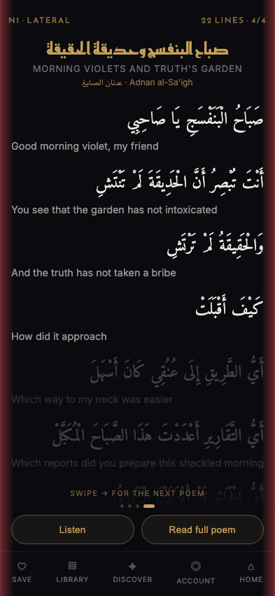
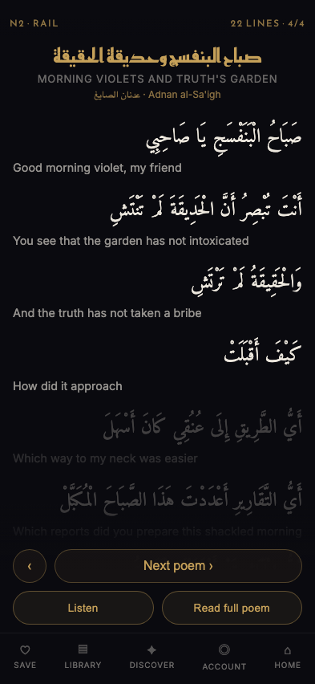
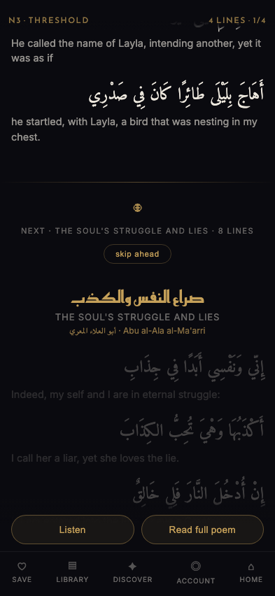
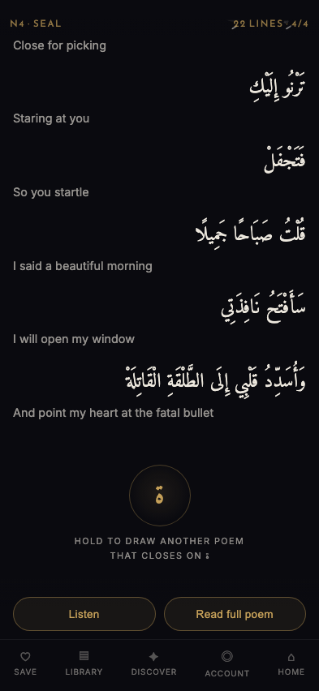
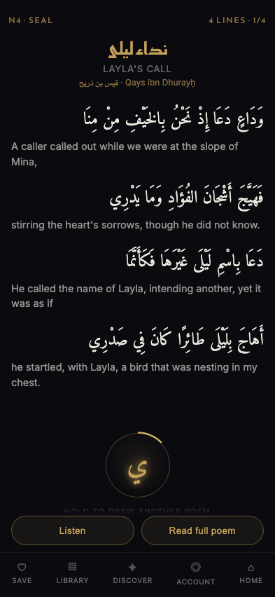
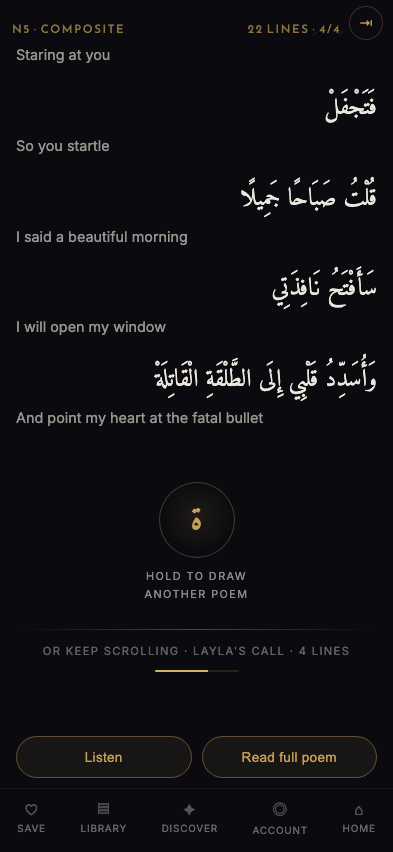

# Poem-to-poem navigation, once B·Flow owns the vertical axis

Working previews for the conflict [#707](https://github.com/lesmartiepants/poetry-bil-araby/pull/707) creates: **B · Flow** makes the poem a continuous scroll, and today a vertical swipe changes poems (`PoemFeed.jsx` binds `pointerdown/move/up` on `window`). Two scroll axes on one screen.

Live at **`/design-review/poem-navigation/board.html`** on any preview deploy. Nothing in `src/` changes.

| | |
|---|---|
| `index.html?opt=` | `n1` lateral · `n2` rail · `n3` threshold · `n4` seal · `n5` composite |
| `&poem=` | `0` 4-line epigram · `1` 8 lines · `2` 10 lines · `3` 22-line qasida |
| `&scrub=1` | put the 56px scrubber lane back |
| `&readout=1` | live box width, fit, type headroom |
| `&dir=ltr` | N1 only — flip which way "next" is |

Poems are the four real bilingual ones from production (`poems-bilingual.json`, verse-aligned translations). The API's `english` field is hardcoded `''` (`server.js:319`) and only ~13% of poems carry a `cachedTranslation`, so bilingual poems have to be hunted for — these were, and **bilingual rows are what everything below is measured against.**

---

## Can the scrubber go? Conditionally yes — and it's worth doing

The rail is doing **four** jobs, not one. Sorting them is the whole answer.

| Job | Where it lives | Under a flow layout |
|---|---|---|
| Reveal progress while reading | `scrubFillRef` height | **Collapses into scroll position** |
| Drag to seek the reveal | `controller.scrubTo` | **Collapses into scrolling there** |
| TTS playback position + seek | `ttsFollow(currentVerseIndex)`, `PoemReader.jsx:545` | **Does not collapse.** Scrolling to verse 9 does not seek the audio to verse 9 |
| Insight paragraph render-progress **and** scroll position | `onInsightProgress` / `onInsightScrollMeta`, `PoemReader.jsx:250-270` | **Does not collapse.** Different surface, still needs an indicator |

Two collapse, two need rehoming. Neither rehoming is exotic: audio position belongs in the transport row that `ReaderActions` already morphs into when you press Listen (a horizontal audio scrubber is the more conventional place for it anyway), and the insight overlay can carry its own indicator instead of borrowing the poem's.

There's a sharper argument than redundancy, and it's the one to lead with. The rail currently means *"how far the reveal has got."* In a flow layout that stops being the same thing as *"where you are in the poem"* — the two can differ by a whole screen. The rail doesn't become **redundant**, it becomes **ambiguous**, and an ambiguous progress indicator is worse than none.

### What removing it buys

Measured across **all 44 verses of all four poems** at 393×852, via `&readout=1`:

| | Poem box | Type headroom | Meaning |
|---|---:|---:|---|
| Lane on (today) | **305px** | **×1.007** | Arabic pinned at its `clamp()` floor with no room left |
| Lane off | **361px** | **×1.191** | 19% of type size available before any line needs a shrink |

*Headroom* = how much larger the Arabic could be before the widest line has to shrink to survive the box. Text width scales linearly with font size, so it's box ÷ widest-natural-width — measured, not asserted.

**Concretely:** the `clamp(1.52rem, 5.7vw, 2.13rem)` floor in `SparklerStage.jsx:148` could rise from **1.52rem to ~1.81rem** — rendered Arabic **24.3px → ~29px** — without a single verse taking a shrink. At 393px, `5.7vw` is 22.4px, well under the floor, so the floor *is* the size on every phone. This is the whole prize.

**A second cost nobody counted.** The narrow box also makes the *English* wrap more often. Compare [`shots/scrubber-on-393x852.png`](shots/scrubber-on-393x852.png) with [`shots/scrubber-off-393x852.png`](shots/scrubber-off-393x852.png): same poem, and with the lane, three verses spill their translation onto a second line. Bilingual rows get taller, so the lane costs **verses on screen** as well as type size. #707 measured the lane's cost to width; it also has a height cost.

---

## The options

### N1 · Lateral — swipe sideways



The axis is latched at `pointerdown` and held for the whole gesture, per the #707 handoff. Red bands mark iOS Safari's ~20px interactive back-swipe zone; gestures starting there are refused rather than fought, because a page cannot reliably beat the system gesture.

**On direction, I have an opinion and it's the opposite of the obvious one.** Arabic is RTL, so the next item sits to the *left* and advancing means dragging content *rightward* — a left-to-right swipe. But Safari's back gesture is a left-to-right swipe from the left edge. **RTL "next" and system "back" are the same motion.** `?dir=ltr` (swipe leftward for next) has no such collision. So: if lateral ships, it should be **LTR-direction**, which also matches the decision to move product chrome to LTR. Poem text is RTL; navigation is chrome.

**Trades:** a whole axis, again. It's still a directional swipe that can fire during a diagonal drag, and it can't use the screen edges. It also gives up the one thing horizontal paging is usually good for — you can't peek at the next poem without committing, because there's nothing to peek at until you've moved.

### N2 · Rail — explicit controls



**Buys:** unambiguous, discoverable, keyboard- and screen-reader-friendly for free, and zero gesture arbitration.

**Trades:** a full 52px row above the reader actions — on a screen where #707 established that 56px of *width* was worth an argument, spending 52px of *height* on navigation chrome is hard to justify. It also reads as a document viewer rather than a poetry app.

### N3 · Threshold — the boundary is content



Poems run continuously. A marked boundary announces the next poem **and its length** before you reach it, with a skip control.

**Buys: there is no gesture to arbitrate, at all.** Scroll never changes meaning, so the latch problem doesn't exist — not "is handled correctly", *doesn't exist*. This is the only option where that's true. It also extends #707's best property: the reader can see what's coming and how long it is before committing.

**Trades, and one is serious.** With two poems on screen at a boundary, **which poem do Save / Listen / Read full poem act on?** The actions bar is global chrome; at the threshold the "current poem" is genuinely ambiguous. It also makes going back mean scrolling up through the whole previous poem, and it makes "how far into *this* poem am I" unanswerable — which argues for the scrubber's removal but does remove a real signal.

### N4 · Seal — a deliberate act at the end

 

*Right: mid-hold. The ring fills, the letter takes the sparkler's glow.*

At the end of the poem sits the letter it closes on. **Press and hold** — the ring charges over 620ms, the letter sparks, and the next poem is drawn. It reuses the app's existing sparkler vocabulary, it's a single thumb-reachable target near the bottom, and it cannot fire by accident.

**It only exists at the end**, which is the point. #707's dimmed-ahead verses put the poem's whole shape on screen from the first frame, so reaching the end is an anticipated event, not a surprise. That's precisely what makes an end-of-poem invitation work here and not in a fixed window.

**A finding that changed the design.** The first version offered *"another poem that closes on ﻝ"* — a rhyme-kinship draw, playing on the قافية the corpus is named for. **The data won't carry it.** A true qasida rhymes every line on one letter; these poems don't. Across the sample the 22-line poem lands on ل just 5 times in 22, and its final letter is **ة** — a feminine-noun suffix that ends a large share of Arabic words. "Another poem that closes on ة" is noise wearing the costume of structure. So the letter became **this poem's own sign-off** rather than a filter on the next. If a themed draw is wanted later, the categorisation facets (`/api/categories` — mood, topic, motif) are real data and would carry it; the rhyme letter is not.

**Trades:** it's only reachable at the end. A reader four verses into a 40-line qasida who wants out has nothing — which is why N5 adds an escape. And a press-and-hold is undiscoverable without the caption, so the caption is load-bearing, not decoration.

### N5 · Composite — threshold + seal + escape



One poem at a time. At its end: the seal for a deliberate draw, an over-scroll continuation for a reader who just wants to keep going, and a top-right escape for bailing out mid-poem.

The over-scroll is the one place N5 reintroduces an end-of-scroll boundary. Three things make it survivable, and they're the same three that make the whole end-of-poem idea work: it exists only at the very end where arrival is anticipated; it needs ~110px of scroll **accumulated past a hard stop**, so flick momentum decays at the stop instead of carrying through; and the meter fills visibly, so the reader sees the commit coming and can stop.

---

## Recommendation: N5, built on N3's principle

**Take N5.** The reasoning, shortest path:

**Anything that shares the vertical axis loses.** The #707 handoff is right that latching at `pointerdown` is necessary — and also that a latched boundary is still a boundary a reader can cross by accident. N1 moves the problem to a different axis rather than removing it, and lands RTL "next" on top of the system back gesture. N2 removes the problem honestly but bills 52px of height for it.

**N3 has the best idea in the set and one flaw that disqualifies it alone.** Making the boundary *content* rather than *gesture* is the real insight — it doesn't manage the conflict, it dissolves it. But global reader actions over a continuous stream leave Save and Listen pointing at an ambiguous target, and that's not a polish item.

**N5 keeps N3's idea and fixes exactly that.** One poem is current at a time, so the actions are never ambiguous, while forward motion still costs nothing more than continuing to read. And the seal answers what the owner actually asked for: a deliberate, engaging act that summons a poem, in the app's own sparkler idiom, at the moment the reader has arrived somewhere.

**Then remove the scrubber**, rehoming audio seek into the transport row and giving the insight overlay its own indicator. That reclaims 56px, which buys **~19% Arabic type size** and fewer wrapped English lines. That is the largest single win available on this screen and it is the owner's stated goal.

If only one thing ships: **N3's threshold principle**, because it's the part that makes the axis conflict go away rather than manage it.

---

## What this preserves, and what it doesn't

| Must keep | Status |
|---|---|
| Sparkler reveal + Next Verse advance | Preserved in shape. **See the caveat below** |
| Poem body is not a tap target | **Preserved.** No option attaches a handler to the poem body; the seal is its own element |
| Reader actions (Listen / Read full poem) | Present in every option |
| Bottom nav (Save / Library / Discover / Account) | Present in every option, all five items |
| `data-owns-gesture` opt-out | N1 honours it. **N2–N5 make it unnecessary for navigation** — they bind no global pointer handler, so a drag inside a floating panel cannot page the poem underneath by construction |
| الميزان draw inspector | Rides on `data-owns-gesture` (`DiscoveryDrawInspector.jsx:615`). Under N2–N5 there is no global gesture to opt out of, so its drag is safe by construction rather than by opt-out |

**The caveat, stated plainly.** These prototypes use a **CSS dim-to-reveal**, not the real GSAP timeline in `useSparklerReveal.js`. They will tell you how navigation *feels*; they will **not** tell you how the sparkle feels. That has to be rebuilt against the real controller before anyone commits — the same warning #707 gave about B, and it still applies.

**One thing that genuinely changes, not a quiet drop:** in a flow layout the reveal is driven by scroll position rather than by a discrete advance. Next Verse survives as "scroll the next unrevealed verse into view", but the reveal stops being a *window* and becomes a *threshold the reader crosses*. That is a real change to the app's signature mechanic and it belongs in the decision, not in a footnote.

---

## Owner tweaks, second pass

### 1. Right-aligning everything — it depends on the scrubber decision

`?align=classic|head|right` (default `right`). Content alignment only; `direction` is untouched and chrome stays LTR.

Classic put **three axes in one column**: a centred head, right-set Arabic, left-set English. Nobody argued for the centred head — it is the odd one out, and moving it costs nothing.

The English is the real question. Right-aligning LTR text leaves each line's **start** ragged, and the start is the edge a Latin reader's eye returns to. So the cost lands **only on English lines that wrap** — a one-line translation right-aligns for free.

Measured across all 44 English lines of all four poems:

| | Wrapped English lines |
|---|---:|
| Scrubber lane **on** | **20 of 44** (45%) |
| Scrubber lane **off** | **8 of 44** (18%) |

That is the same 56px the type-size argument turns on, showing up a third time. Removing the lane doesn't just buy Arabic size and fewer wrapped rows — it also **removes most of what right-alignment costs**.

**Recommendation: ship `right`, conditional on the scrubber going.** If the lane stays, ship `head` — the head and byline join the right edge, the English keeps its left start, and you get most of the unification for none of the cost.

### 2. N4 · Seal — the summon happens to the screen

The hold is a build, not a wait:

- **hold** — the poem recedes and dims, a gold bloom grows out of the seal, a vignette closes in around it, the ring charges, the letter takes the glow.
- **commit** — a ring bursts outward, sparks throw wider, and the spent poem lifts and dissolves rather than being cut away.
- **arrive** — the verses land in sequence while a band of gold light travels down the column: the sparkler's lit-in-sequence idea at poem scale.

`HOLD` went 620ms → **760ms**, because at 620 the bloom had not finished growing before it fired.

**What it costs, and why it holds.** Every layer animates transform and opacity only. The poem's recede is a class-toggled CSS transition, so no per-frame JS touches the 22 verse rows; `--p` is read by two childless overlay divs, which bounds per-frame style invalidation at four small elements. The verse stagger is **transform only** — opacity stays owned by `.ahead`/`.read`, so the poem still arrives dimmed-ahead and the sparkler reveal still has work to do. The light sweep is one translating element instead of an animation on every verse.

Measured over a full summon on the 22-verse poem: **350 frames, median 8.3ms, worst 9.7ms, zero frames over 16.7ms.** That is desktop headless, not a phone — the architecture is what should carry it to device, and it still wants confirming there. `prefers-reduced-motion` drops the whole effect.

The real cost is **time**: from press to a settled new poem is ~1.6s (760 hold + 340 dissolve + ~520 stagger). Deliberate by design, but it is not a control you would want to use twenty times in a row.

### 2b. The quill, and the poem sparkling in

**The control is a quill, not the poem's closing letter.** The letter was a sign-off: it pointed backwards at the poem you had just finished. A quill points forwards — it writes the next poem into being — which is what the gesture actually does. It also survives contact with the corpus, which the letter only barely did.

The hold is the stroke. The quill tilts from upright into a writing angle, travels left to right, ink gathers at the nib, and a gold line grows behind it. Release early and the stroke un-draws, because `--p` decays rather than snapping. All of it is transform on three small elements.

**The arrival sparkle collides with the reading reveal, and here's how it's resolved.**

The reader's sparkler lights **one verse at a time** and **leaves it lit**. Its claim is *"you are reading this now."* If the arrival sparkle also persisted, it would claim *"this poem is read"* — the opposite — and the reading reveal would arrive second with nothing left to do.

So the two are separated by **persistence, not speed**. The arrival passes through and leaves nothing behind: the column rises out of black while 90 motes catch light across the whole surface, and it settles into exactly the dimmed-ahead state every poem starts in, with **nothing marked as read**. It's an entrance; the reveal is a reading. Same vocabulary, opposite persistence.

That's also why the per-verse landing stagger from the previous pass is **gone**. "In sequence, verse by verse" is the reading reveal's sentence, and the entrance must not speak it — two mechanics saying the same thing would make the reveal feel redundant.

**Caveat, restated because it bites hardest here.** These prototypes use a CSS dim-to-reveal, not the real GSAP timeline. This shows the *idea* of the sparkle and how it divides labour with the reveal. It will **not** tell you how the sparkle feels. That judgement needs the real controller.

**Long press is exactly the gesture that raises Safari's selection callout**, so on device the quill was being picked up as a selectable object mid-summon. `user-select` alone doesn't cover it: Safari needs the `-webkit-` prefix *and* `-webkit-touch-callout`, and it has to reach the SVG rather than stopping at the wrapper. The drawing now takes no pointer events at all — the `.seal` box is the only target — and `contextmenu` / `selectstart` / `dragstart` are refused. `-webkit-touch-callout` can't be verified from headless Chromium (it's Safari-only), so that one is confirmed on device or not at all.

Two things the build forced:

- *The bloom had to move behind the reading surface.* It was painted over everything, so at full charge the quill disappeared into the light it was making. The atmosphere (bloom, vignette) now sits under the poem and the flash layers (burst, sweep, motes) sit above it. The bloom also became a **halo** — dimmest at its own centre, where the quill is.
- *46 motes read as stray specks.* Only ~20 were at peak in any frame. 90, with delays packed into 420ms so they overlap, reads as the surface catching light.

Measured over a full summon on the 22-verse poem: **388 frames, median 8.3ms, worst 11.0ms, zero over 16.7ms.** The 90 motes cost about 1.3ms at the worst frame.

### 3. N3 · Threshold — staged handoff, and the flaw is fixed

1. **reading** — one poem, scrolling normally.
2. **revealing** — across the last **170px** of the poem the handoff **fades in**, tied directly to scroll position. Opacity and nothing else: it sits exactly where it will end up and simply becomes visible as the reader arrives. Scrolling back up puts it away at the same rate. **No transition and no movement, deliberately** — the reveal *is* the scroll, so interpolating would lag the finger, and sliding it into place would make it an entrance animation again, which was the thing that was wrong with it.
3. **pulling** — once fully revealed, a distinct gesture past the stop fills the meter.
4. **locked** — the next poem arrives and locks to top.

The only case that fades rather than tracking scroll is the poem shorter than the viewport, which has no scroll to ride.

**This fixes the disqualifying flaw.** The ambiguous Save/Listen target came from two poems being on screen at a boundary. With arrival locked to top, **every resting state has exactly one current poem**. The only two-poem moment is the 260ms crossfade — a transition, not a state a reader can sit in and press a button. I looked for surviving ambiguity and did not find any: there is no scroll position that leaves two poems addressable.

**The gesture that arrives cannot also commit.** A pull only counts if its gesture *began* after the offer appeared. That is #707's pointerdown latch applied to a boundary instead of an axis — the flick that carries you to the bottom must not carry you past it. On wheel, gesture boundaries are inferred from a 140ms pause; a run already in flight when the offer lands stays spent until it stops.

**Two things the build turned up.**

*The affordance cannot grow.* If the handoff block expanded when it appeared it would add scroll height, the reader would stop being at the bottom, and the offer would retract the frame after it was made. It is a fixed 118px in the flow at all times; only its contents fade in.

*A short poem has no bottom to reach.* The 4-line epigram fits the viewport with room to spare, so it is "at the end" the instant it arrives and the stage machine collapses — the offer appeared 260ms after arrival, over a poem nobody had read. A **1400ms floor** on time-since-arrival stands in for the scroll that never happens. Long poems have already spent far more than that getting to the bottom, so the floor never binds for them.

Tap or keyboard on the chevron is an equal path to over-pulling.

## Verify it yourself

```bash
python3 -m http.server 4178          # from the repo root; `serve` drops query strings
open http://localhost:4178/design-review/poem-navigation/board.html
```

The scrubber numbers come from `window.__measure()` on any option page, or `&readout=1` for the on-screen version.

Read-only throughout. No database is touched; `poems-bilingual.json` is a static capture.
