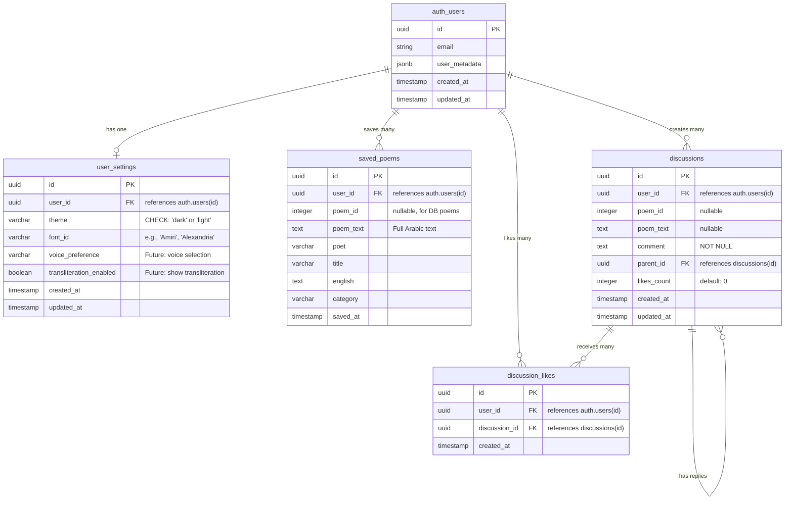

# Database Schema - Entity Relationship Diagram

## Mermaid ERD



## Table Details

### auth.users (Supabase Built-in)
- **Purpose**: Core authentication table managed by Supabase
- **Access**: Via `auth.uid()` in RLS policies
- **Contains**: Email, OAuth provider data, user metadata (avatar, name, etc.)

### user_settings
- **Purpose**: Store user preferences that persist across sessions
- **Constraints**: 
  - `UNIQUE(user_id)` - one settings record per user
  - `theme CHECK IN ('dark', 'light')`
- **RLS**: Users can only view/modify their own settings
- **Indexes**: Primary key on `id`
- **Future Fields**: 
  - `voice_preference`: For selecting recitation voice
  - `transliteration_enabled`: Toggle Arabic transliteration display

### saved_poems
- **Purpose**: User's personal collection of favorite poems
- **Handles Two Cases**:
  1. Database poems: Uses `poem_id` (integer reference)
  2. AI-generated poems: Uses `poem_text` (full text storage)
- **Constraints**: 
  - `UNIQUE(user_id, poem_id, poem_text)` - prevents duplicate saves
- **RLS**: Users can only view/modify their own saved poems
- **Indexes**: 
  - `idx_saved_poems_user_id` - fast user lookups
  - `idx_saved_poems_poem_id` - fast poem lookups
  - `idx_saved_poems_saved_at DESC` - chronological ordering

### discussions (Future Feature)
- **Purpose**: Comments and discussions on poems
- **Features**:
  - Public read access (anyone can view)
  - Threaded discussions via `parent_id` self-reference
  - Supports both DB poems (`poem_id`) and AI poems (`poem_text`)
- **RLS**: 
  - Anyone can SELECT
  - Only authenticated users can INSERT
  - Users can only UPDATE/DELETE their own discussions
- **Indexes**:
  - `idx_discussions_user_id` - user's discussions
  - `idx_discussions_poem_id` - poem's discussions
  - `idx_discussions_created_at DESC` - recent first

### discussion_likes (Future Feature)
- **Purpose**: Like/upvote discussions
- **Constraints**: 
  - `UNIQUE(user_id, discussion_id)` - one like per user per discussion
- **RLS**: 
  - Anyone can SELECT (public likes count)
  - Authenticated users can INSERT (like)
  - Users can only DELETE their own likes (unlike)
- **Indexes**: 
  - `idx_discussion_likes_discussion_id` - fast likes count

## Row Level Security (RLS) Policies

### user_settings
```sql
-- Users can view own settings
CREATE POLICY "Users can view own settings" ON user_settings
  FOR SELECT USING (auth.uid() = user_id);

-- Users can insert own settings
CREATE POLICY "Users can insert own settings" ON user_settings
  FOR INSERT WITH CHECK (auth.uid() = user_id);

-- Users can update own settings
CREATE POLICY "Users can update own settings" ON user_settings
  FOR UPDATE USING (auth.uid() = user_id);

-- Users can delete own settings
CREATE POLICY "Users can delete own settings" ON user_settings
  FOR DELETE USING (auth.uid() = user_id);
```

### saved_poems
```sql
-- Users can view own saved poems
CREATE POLICY "Users can view own saved poems" ON saved_poems
  FOR SELECT USING (auth.uid() = user_id);

-- Users can save poems
CREATE POLICY "Users can save poems" ON saved_poems
  FOR INSERT WITH CHECK (auth.uid() = user_id);

-- Users can delete own saved poems
CREATE POLICY "Users can delete own saved poems" ON saved_poems
  FOR DELETE USING (auth.uid() = user_id);
```

### discussions
```sql
-- Anyone can view discussions
CREATE POLICY "Anyone can view discussions" ON discussions
  FOR SELECT USING (true);

-- Authenticated users can create discussions
CREATE POLICY "Authenticated users can create discussions" ON discussions
  FOR INSERT WITH CHECK (auth.uid() = user_id);

-- Users can update own discussions
CREATE POLICY "Users can update own discussions" ON discussions
  FOR UPDATE USING (auth.uid() = user_id);

-- Users can delete own discussions
CREATE POLICY "Users can delete own discussions" ON discussions
  FOR DELETE USING (auth.uid() = user_id);
```

### discussion_likes
```sql
-- Anyone can view discussion likes
CREATE POLICY "Anyone can view discussion likes" ON discussion_likes
  FOR SELECT USING (true);

-- Authenticated users can like discussions
CREATE POLICY "Authenticated users can like discussions" ON discussion_likes
  FOR INSERT WITH CHECK (auth.uid() = user_id);

-- Users can delete own likes
CREATE POLICY "Users can delete own likes" ON discussion_likes
  FOR DELETE USING (auth.uid() = user_id);
```

## Auto-Update Triggers

### updated_at Timestamp
```sql
CREATE OR REPLACE FUNCTION update_updated_at_column()
RETURNS TRIGGER AS $$
BEGIN
  NEW.updated_at = NOW();
  RETURN NEW;
END;
$$ LANGUAGE plpgsql;

-- Applied to:
CREATE TRIGGER update_user_settings_updated_at
  BEFORE UPDATE ON user_settings
  FOR EACH ROW EXECUTE FUNCTION update_updated_at_column();

CREATE TRIGGER update_discussions_updated_at
  BEFORE UPDATE ON discussions
  FOR EACH ROW EXECUTE FUNCTION update_updated_at_column();
```

## Data Flow Examples

### User Signs In
1. User clicks "Sign In" → Opens AuthModal
2. User selects Google/Apple → Redirects to OAuth provider
3. OAuth provider authenticates → Redirects back with token
4. Supabase creates/updates `auth.users` record
5. App loads user settings from `user_settings` table
6. App loads saved poems from `saved_poems` table

### User Changes Theme
1. User toggles dark/light mode → State updates immediately
2. After 1-second debounce → `saveSettings()` called
3. `user_settings` table upserted with new theme
4. On next app load → Theme restored from database

### User Saves Poem
1. User clicks heart button → `savePoem()` called
2. New record inserted into `saved_poems` with:
   - `user_id`: Current user's ID
   - `poem_id` or `poem_text`: Depending on poem source
   - `poet`, `title`, `english`, `category`: Poem metadata
3. Heart button fills red to indicate saved state
4. Poem appears in user's collection (future UI)

### User Likes Discussion (Future)
1. User clicks like on discussion → `INSERT` into `discussion_likes`
2. `likes_count` on `discussions` incremented (via app logic)
3. Discussion shows updated like count
4. User can unlike by clicking again → `DELETE` from `discussion_likes`

## Migration File
Location: `supabase/migrations/20260119000000_auth_and_user_features.sql`

Contains:
- All table definitions
- All RLS policies
- All indexes
- All triggers and functions
- UUID extension setup

## Notes
- **UUIDs**: Using UUID v4 for all primary keys (security, distribution)
- **Timestamps**: All with time zone (UTC by default)
- **Soft Deletes**: Not implemented - hard deletes for simplicity
- **Cascading**: `ON DELETE CASCADE` ensures referential integrity
- **Nullable Fields**: `poem_id` and `poem_text` to handle both DB and AI poems
- **Future-Proof**: Voice and transliteration fields ready for implementation
