# Feature Mockups Index

All feature mockups for save, login/auth, heart, and transliteration — consolidated from 3 open PRs.

---

## Where Everything Lives

| Feature | PR | Branch | Status |
|---|---|---|---|
| Heart / Save / Transliteration / Zoom | [#50](https://github.com/lesmartiepants/poetry-bil-araby/pull/50) | `copilot/explore-ui-controls-implementation` | OPEN |
| Login / Auth SSO / Save / Heart | [#49](https://github.com/lesmartiepants/poetry-bil-araby/pull/49) | `copilot/setup-user-authentication-sso` | OPEN |
| Intro + Main App Layouts (L-U) | [#51](https://github.com/lesmartiepants/poetry-bil-araby/pull/51) | `cursor/intro-main-app-mockups-6919` | OPEN |

---

# 1. Heart / Save / Transliteration Controls (PR #50)

5 vertical control bar mockups — each includes heart/save with counter, text zoom (3 levels), and transliteration toggle.

## Option 1 — Minimalist (Jony Ive)

Right-aligned, icons-only, glass morphism at 3-8% opacity. Maximum restraint.

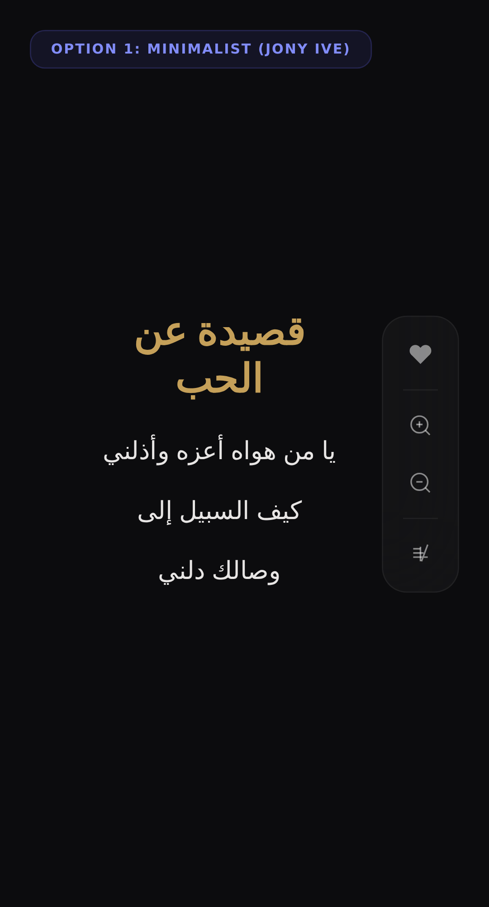

## Option 3 — Notion / Linear

Right-aligned, compact 40px, A+/A- zoom, dark tooltips, 1px gaps. Functional minimalism.

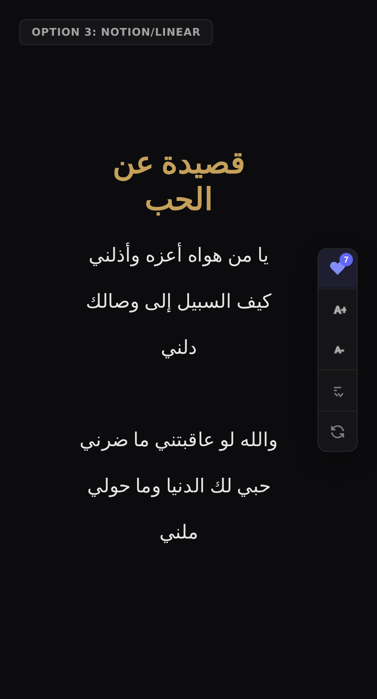

## Option 4 — Brutalist Terminal (Wild Card)

Full-height left sidebar. Retro CRT aesthetic, monochrome green, scan lines, live clock.

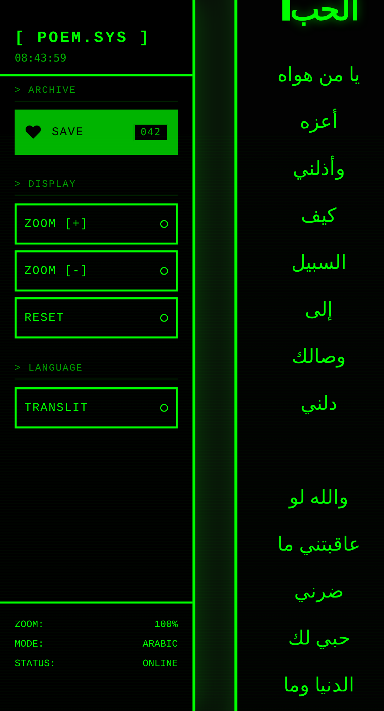

## Option 6 — Neumorphic (Soft UI)

Left sidebar on light background. Soft shadows, tactile raised/inset states, grouped sections.


## Option 9 — Scandinavian Minimal

Right-aligned circular buttons on light. Minimal shadows, Nordic simplicity.


---

# 2. Login / Auth / SSO (PR #49)

Full Supabase authentication with Google + Apple OAuth, user settings persistence, and saved poems.

## Desktop — Not Signed In

Control bar with Sign In button and grayed-out Save heart.

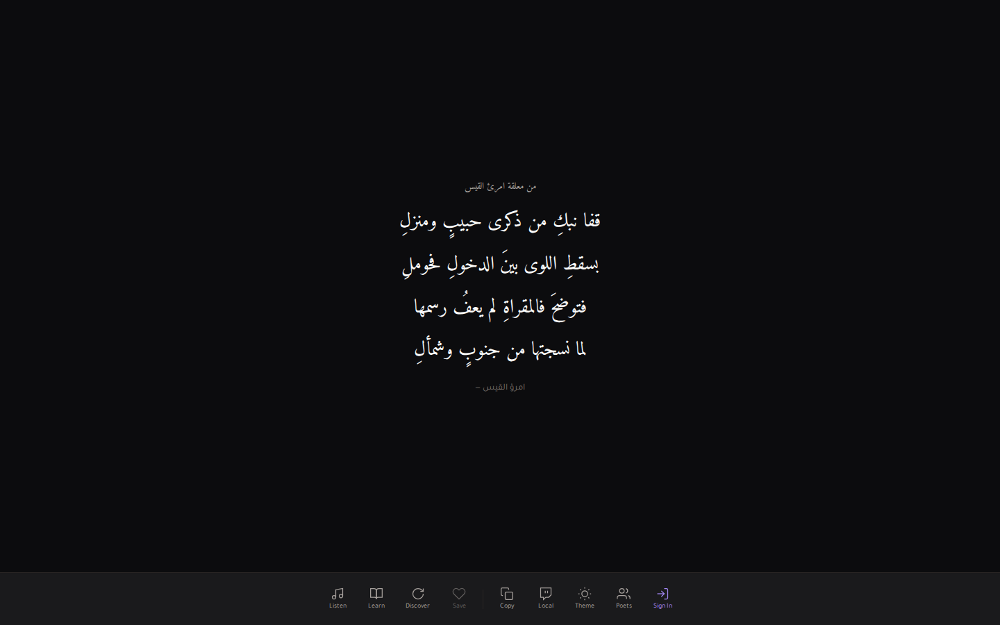

## Authentication Modal

Google and Apple OAuth with Arabic welcome message ("مرحباً").


## Save Button Tooltip (Unauthenticated)

"Sign in to save poems" tooltip appears when clicking heart without being logged in.


## Mobile — Compact Control Bar

Responsive layout with overflow menu for additional controls.

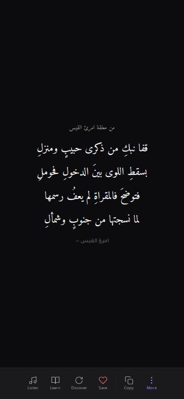

## Mobile — Overflow Menu

Full menu with bilingual labels (Arabic + English).


---

# 3. Intro + Main App Mockups (PR #51)

10 distinct layout directions, each pairing a landing intro with a main reading screen.

## Option L — Celestial Lens

Cosmic orbits, lens-style poem focus, floating controls.


## Option M — Calligraphic Minimal

Parchment, ink strokes, large calligraphy + quiet controls.

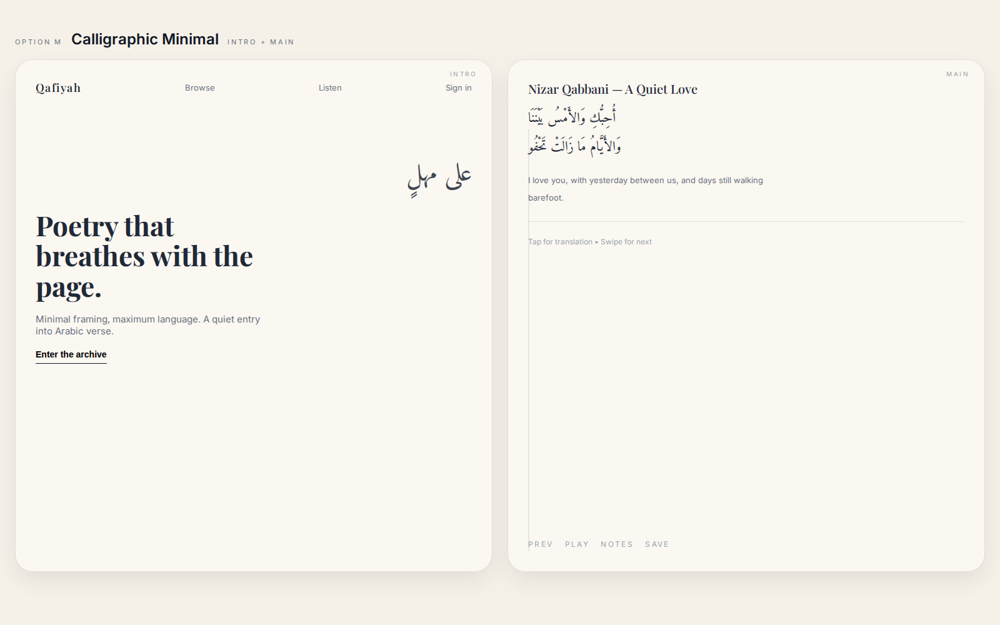

## Option N — Bento Atlas

Bento grid intro, modular cards, atlas side-pane reading.


## Option O — Desert Horizon

Warm sunrise gradients, stamps, airy poem card.

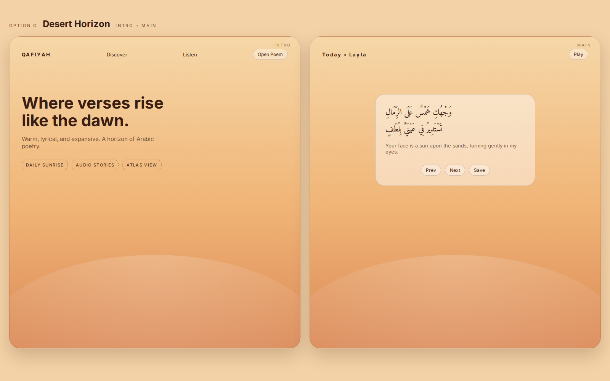

## Option P — Ink Mono

Monochrome editorial, dot grid, typewriter-style controls.

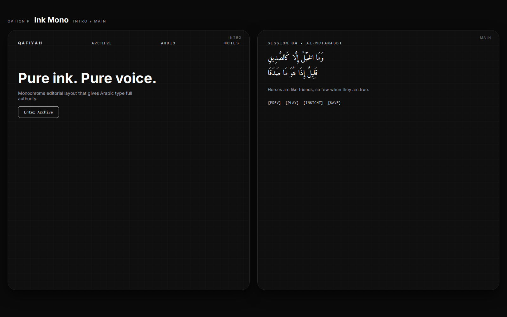

## Option Q — Glass Pavilion

Frosted panels, layered glass cards, calm hierarchy.

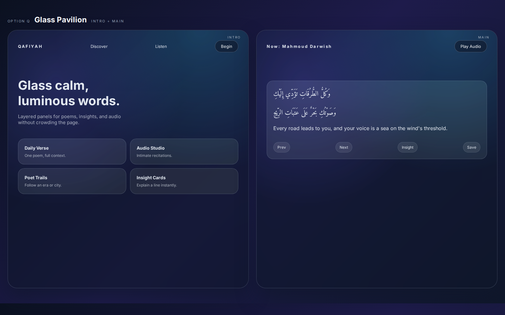

## Option R — Library Catalog

Bookshelf nav, catalog index, archival reader pane.

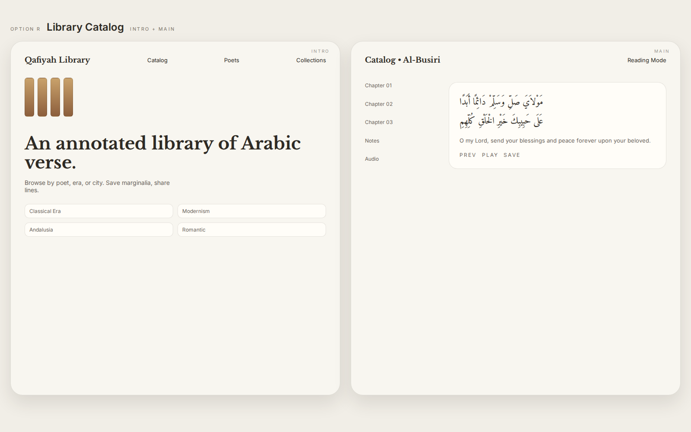

## Option S — Rhythm Wave

Audio-first waveform, rhythm controls, player focus.

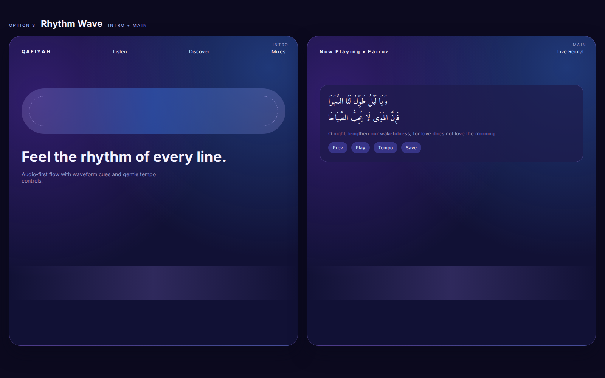

## Option T — Mosaic Tiles

Geometric tile navigation, pattern framing for poems.


## Option U — Scroll Story

Chapter timeline, story arcs, sticky navigation controls.

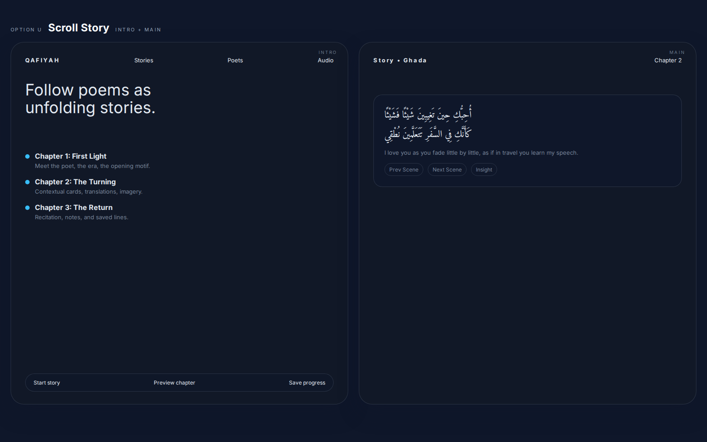

---

# 4. Base Layout Mockups (on `main` — already merged)

11 splash/main layout explorations. These are in the repo at `mockups/`.

| Option | File | Focus |
|---|---|---|
| A | `option-a-refined-serendipity.html` | Refined random discovery |
| B | `option-b-elegant-discovery.html` | Elegant poem browsing |
| C | `option-c-scroll-clean.html` | Clean scroll layout |
| D | `option-d-scroll-exciting.html` | Dynamic scroll experience |
| E | `option-e-scroll-hybrid.html` | Hybrid scroll approach |
| F | `option-f-deco-frame-dropdown.html` | Decorative frame + dropdown |
| G | `option-g-scroll-refined-e-controls.html` | Refined scroll with controls |
| H | `option-h-minimal-deco.html` | Minimal decorative |
| I | `option-i-heavy-frame-inline-category.html` | Heavy frame + inline category |
| J | `option-j-heavy-frame-icon-only-category.html` | Heavy frame + icon-only category |
| K | `option-k-heavy-frame-book-category.html` | Heavy frame + book category (chosen design) |

---

# 5. Implementation Details (PR #49)

## Auth Flow

```
User taps "Sign In"
       |
       v
  AuthModal opens
  (Google / Apple OAuth)
       |
       v
  Supabase handles redirect
       |
       v
  Session restored --> useAuth() hook
       |
       v
  Heart/Save enabled, settings synced
```

## Database Schema

```
auth_users
  |-- user_settings  (theme, font, voice, transliteration_enabled)
  |-- saved_poems    (poem_id, poem_text, poet, title, category)
  |-- discussions    (comment, parent_id, likes_count)  [future]
  |-- discussion_likes  [future]
```

## Key Files (on PR #49 branch)

- `src/hooks/useAuth.js` — `useAuth()`, `useUserSettings()`, `useSavedPoems()`
- `src/supabaseClient.js` — client with env var validation + graceful degradation
- `src/app.jsx` — AuthModal, AuthButton, SavePoemButton components
- `supabase/migrations/20260119000000_auth_and_user_features.sql`
- `docs/AUTHENTICATION_SETUP.md` — full setup guide
- `docs/AUTH_UI_SCREENSHOTS.md` — visual guide with all UI states
- `docs/DATABASE_ERD.md` — Mermaid ERD

## Button Layout (Desktop Control Bar)

```
[ Listen ] [ Learn ] [ Discover ] [ Save ❤️ ] | [ Copy ] [ Local/Web ] [ Theme ] [ Poets ] [ Sign In ]
```

---

# Links

- [PR #49 — Auth/SSO/Login/Save](https://github.com/lesmartiepants/poetry-bil-araby/pull/49)
- [PR #50 — Heart/Save/Zoom/Transliteration Controls](https://github.com/lesmartiepants/poetry-bil-araby/pull/50)
- [PR #51 — Intro/Main Mockups (L-U)](https://github.com/lesmartiepants/poetry-bil-araby/pull/51)
- [PR #53 — Mockup Preview Gallery](https://github.com/lesmartiepants/poetry-bil-araby/pull/53)
- [PR #59 — Design Review Page (MERGED)](https://github.com/lesmartiepants/poetry-bil-araby/pull/59)
